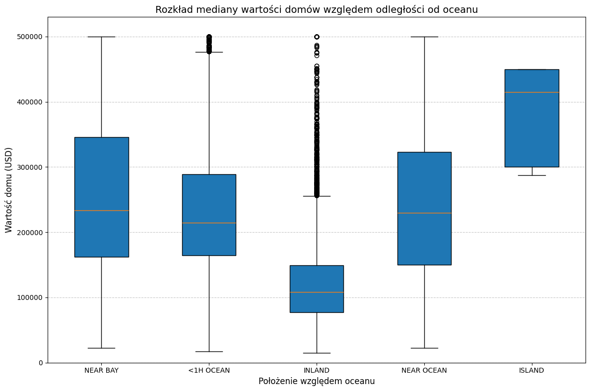
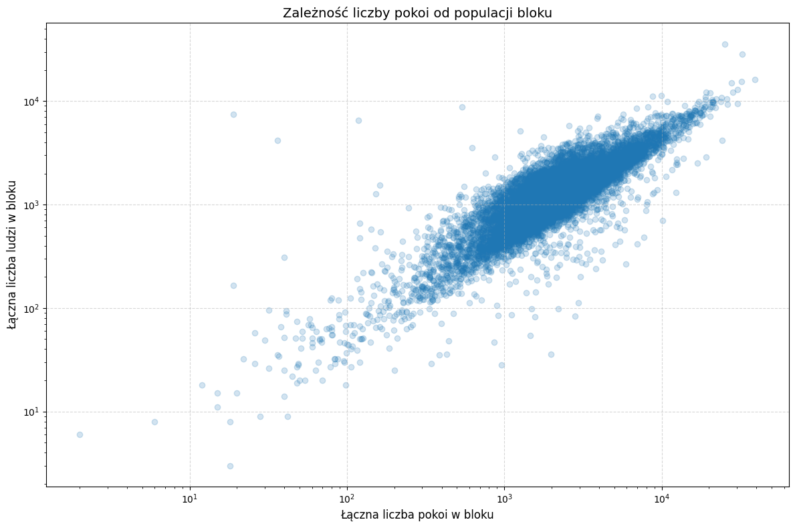
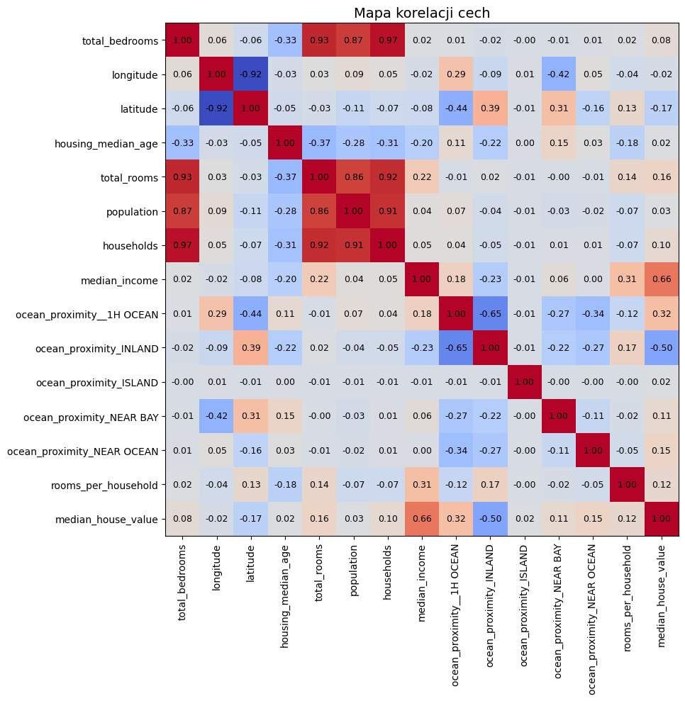
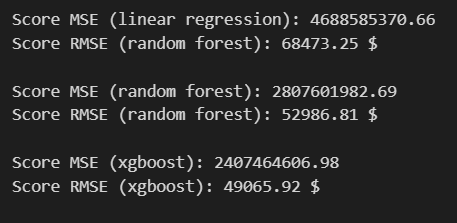

# Housing Price Predictor

A data-driven approach to real estate valuation. Features data cleaning, feature engineering, and a comparison of different regression techniques to achieve the best accuracy.

## 📖 Project Overview

Predicting property values is a cornerstone of real estate analytics. This repository contains a complete Machine Learning project for housing price forecasting using advanced regression algorithms (e.g. **Random Forest**, **XGBoost**).

## ✨ Key Features

- **Data Cleaning**: Handling missing values, outliers, and categorical encoding.
- **Exploratory Data Analysis (EDA)**: Identification of price-driving factors.
- **Advanced Modeling**: Comparative analysis of Linear Regression, Random Forest, and Gradient Boosting.
- **Evaluation Metrics**: Models are assessed using MSE and RMSE scores.

## 📊 EDA Charts

Visualizing the data was a crucial step in understanding the relationships between different property features and their final sale prices.

#### 1. Impact of ocean proximity on house value

This boxplot analyzes how proximity to the ocean affects the distribution of median house values. Houses located on an 'ISLAND' show significantly higher and more concentrated values, while 'INLAND' properties are generally the most affordable but contain many high-value outliers.



#### 2. Room count vs. block population

The scatter plot, presented on log-log scales, reveals a strong positive, linear correlation between the total number of rooms and the population within a block. This confirms that as the number of residents increases, the residential infrastructure scales up proportionately, with some deviations at the extremes.



#### 3. Correlation heatmap

This matrix displays the Pearson correlation coefficients between numerical variables, highlighting which features have the strongest impact on the target.



## 📈 Performance Comparison

| Model                 |        MSE        |      RMSE      |
| :-------------------- | :---------------: | :------------: |
| **Linear Regression** |   4688585370,66   |   68473,25 $   |
| **Random Forest**     |   2807601982,69   |   52986,81 $   |
| **XGBoost**           | **2407464606,98** | **49065,92 $** |

<br>

**Final results:**



**Key Finding:** While simpler models provided a solid baseline, the XGBoost implementation reduced the Root Mean Squared Error by approximately _24%_, demonstrating the value of gradient boosting in handling non-linear housing data.

## 🛠️ Tech Stack

- **Core**: Python 3
- **Analysis**: Pandas, NumPy
- **ML Frameworks**: Scikit-Learn, XGBoost
- **Visualization**: Seaborn, Matplotlib

## 🚀 How to Run?

1. **Clone the repository:**
   ```bash
   git clone https://github.com/Mr-TwisT/Housing-Price-Predictor.git
   ```
2. **Install dependencies:**
   ```bash
   pip install os kagglehub numpy pandas seaborn matplotlib sklearn xgboost
   ```
3. **Run the .ipynb file**
